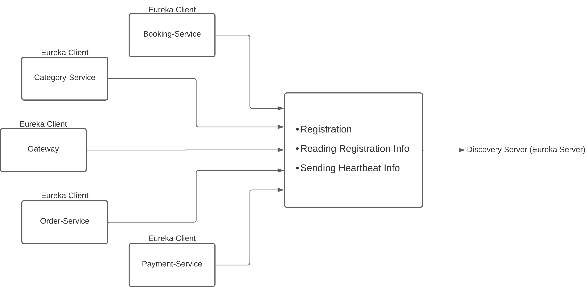
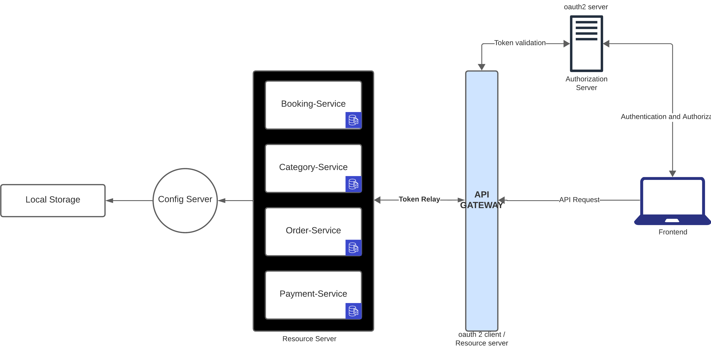
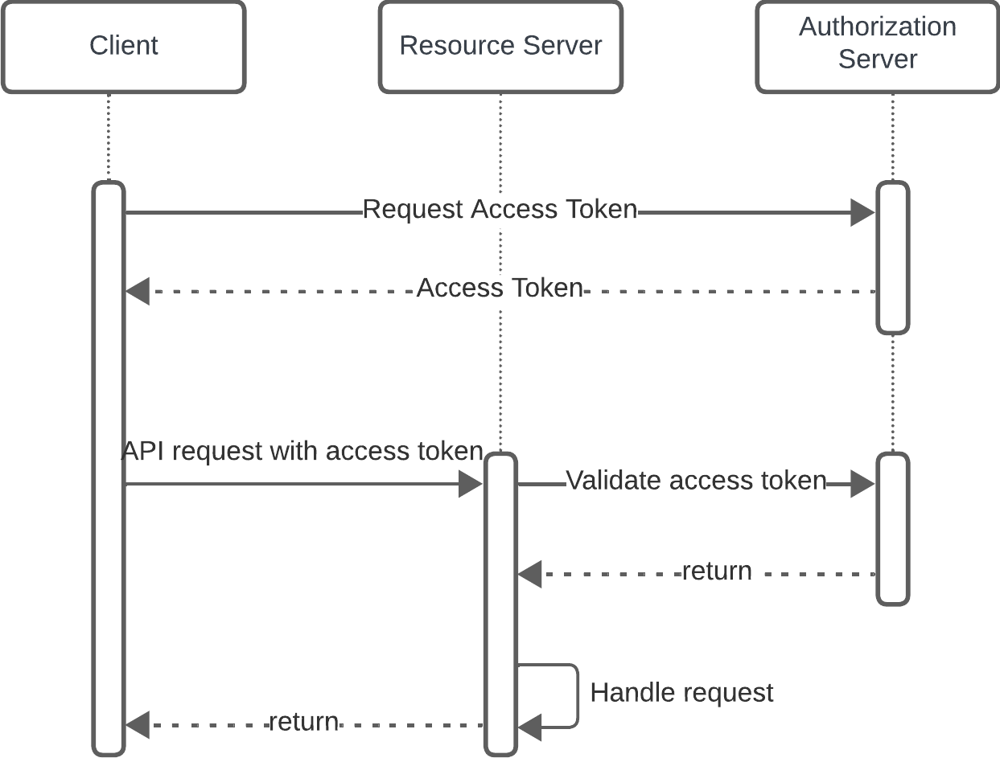
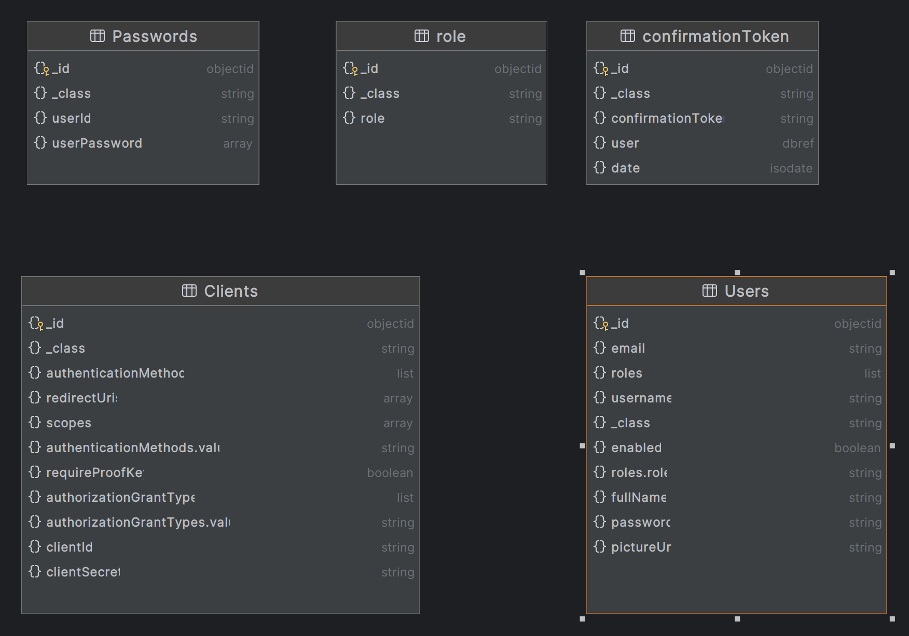
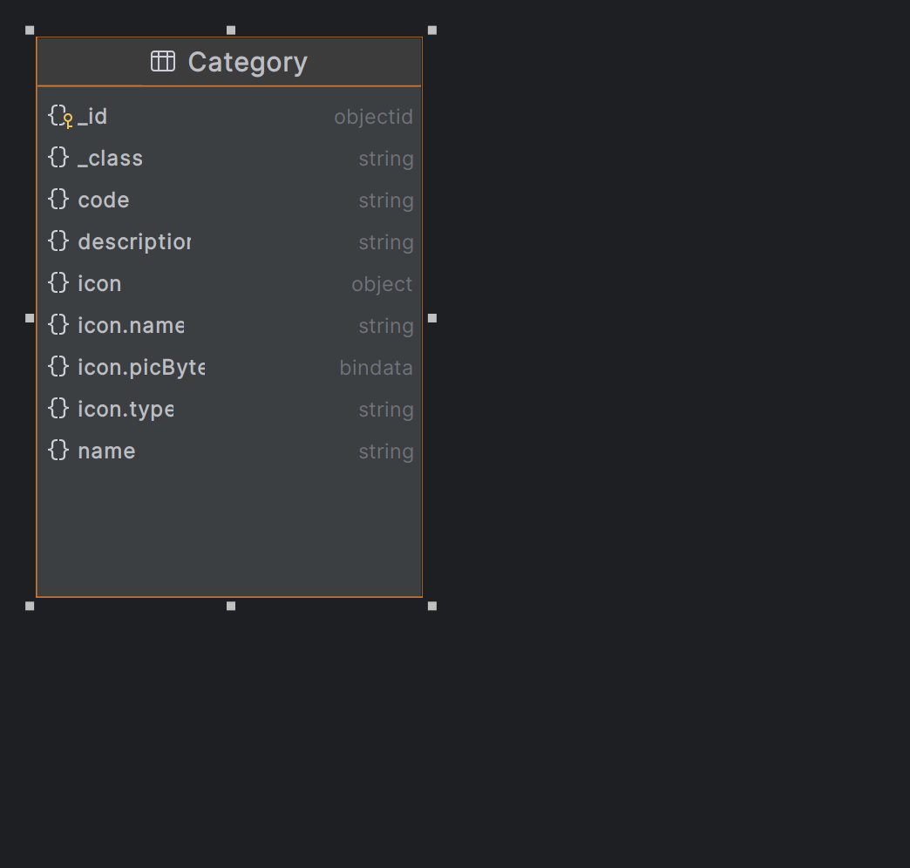
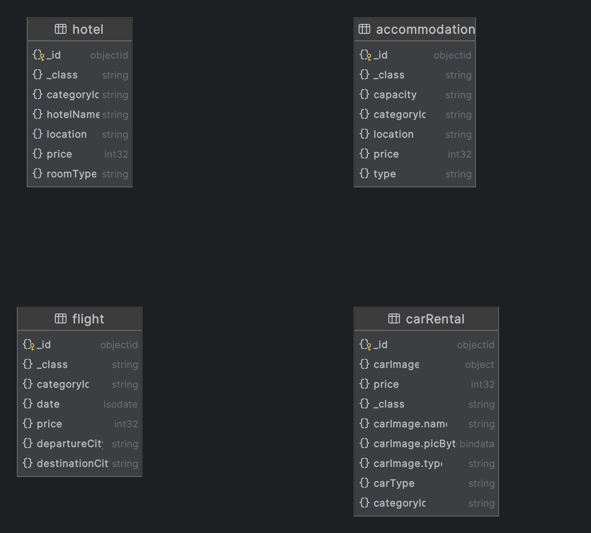
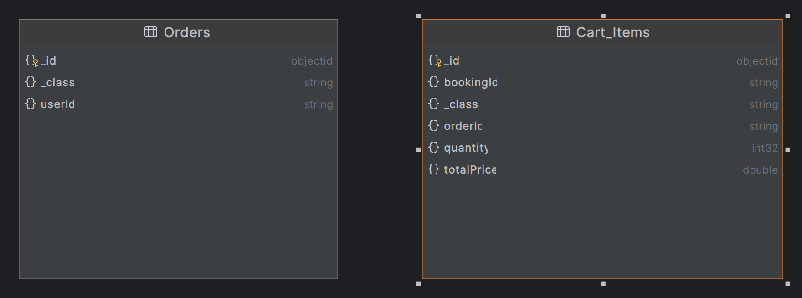
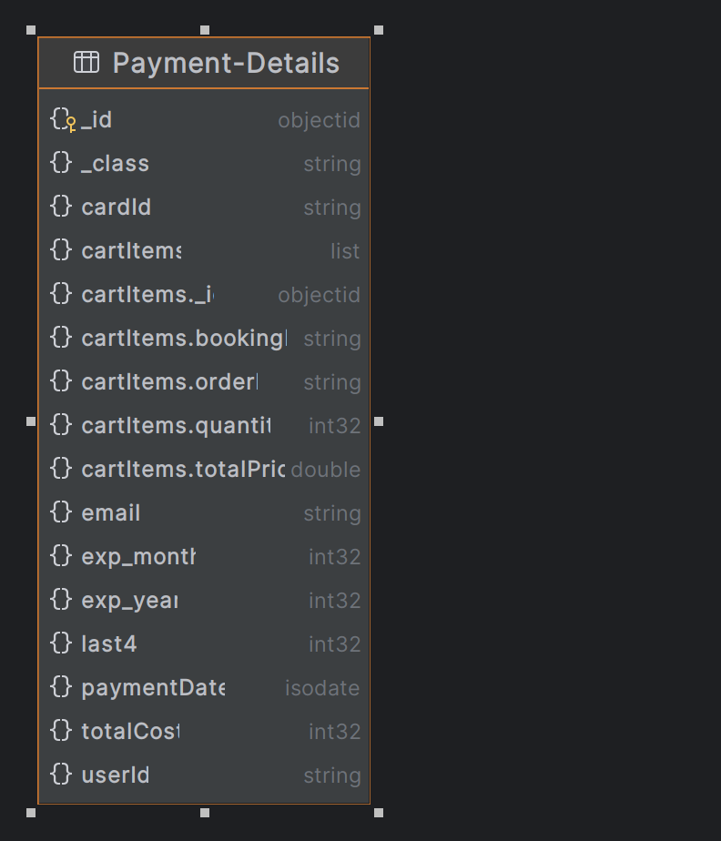

# TRAVEL BOOKING SYSTEM MICROSERVICE
This project is a travel booking system aimed at providing a reliable and user-friendly platform for booking travel accommodations such as flights, hotels, and rental cars.

## FEATURES
- Flight Booking: Users can search and book flights based on their preferences such as date, time, and destination.
- Hotel Booking: Users can search and book hotel accommodations based on location, date, and amenities.
- Rental Car Booking: Users can search and book rental cars based on pickup location, date, and car type.
- Accommodation Booking: Users can search and book accommodations based on location, type( house, appartment), and capacity
- User Authentication: Secure user authentication system to manage user accounts and bookings.
- Admin Panel: Admin panel for managing flights, hotels, rental cars, and user bookings.

## TECHNOLOGIES USED
- Angular: Frontend framework for building the user interface.
- Spring Boot: Backend server for handling requests, user authentication, user authorization and database operations.
- MongoDB: NoSQL database for backend data.
- Bootstrap: Frontend framework for responsive design and styling.

## USAGE
- Create .env file in the root folder
```
# AUTH SERVER CONFIGURATION
GOOGLE_ID=your_google_id
GOOGLE_SECRET=your_google_secret
GITHUB_ID=your_github_id
GITHUB_SECRET=your_github_secret
EMAIL_USERNAME=your_email_username
EMAIL_PASSWORD=your_email_password

# DATABASE CONFIGURATION
# Maintain the same MONGODB_AUTH_DB, MONGODB_PORT
# When using docker compose maintain MONGODB_HOST value else localhost
MONGODB_AUTH_DB=admin
MONGODB_USERNAME=your_mongodb_username
MONGODB_PASSWORD=your_mongodb_password
MONGODB_PORT=27017
MONGODB_HOST=host.docker.internal
MONGO_EXPRESS_BASIC_AUTH_USERNAME=your_basic_auth_username
MONGO_EXPRESS_BASIC_AUTH_PASSWORD=your_basic_auth_password
MONGODB_AUTH_SERVER_DB=your_auth_server_db
MONGODB_BOOKING_SERVICE_DB=your_booking_service_db
MONGODB_CATEGORY_SERVICE_DB=your_category_service_db
MONGODB_ORDER_SERVICE_DB=your_order_service_db
MONGODB_PAYMENT_SERVICE_DB=your_payment_service_db

# URL
CONFIG_SERVER_URL=http://${CONFIG_SERVER_HOST_NAME}:8888
JWT_SET_URI=http://${AUTH_SERVER_HOST_NAME}:8080/oauth2/jwks
ISSUER_URI=http://${AUTH_SERVER_HOST_NAME}:8080
FRONTEND_URL=http://127.0.0.1:4200
ANGULAR_REDIRECT_URI=http://127.0.0.1:4200/login/oauth2/code/angular-client
ZIPKIN_URI=http://${ZIPKIN_HOST_NAME}:9411

# HOST NAME
# Maintain the same host name values below when using docker-compose else use localhost when running locally
AUTH_SERVER_HOST_NAME=auth-server
BOOKING_SERVICE_HOST_NAME=booking-service
CATEGORY_SERVICE_HOST_NAME=category-service
CONFIG_SERVER_HOST_NAME=config-server
DISCOVERY_SERVER_HOST_NAME=discovery-server
GATEWAY_HOST_NAME=gateway
ORDER_SERVICE_HOST_NAME=order-service
PAYMENT_SERVICE_HOST_NAME=payment-service
ZIPKIN_HOST_NAME=zipkin
RABBITMQ_HOST_NAME=rabbitmq

# RABBITMQ CONFIGURATION
RABBITMQ_HOST=${RABBITMQ_HOST_NAME}
RABBITMQ_PORT=5672
RABBITMQ_USERNAME=your_rabbitmq_username
RABBITMQ_PASSWORD=your_rabbitmq_password

# EUREKA CONFIGURATION
EUREKA_HOST=discovery-server
EUREKA_DEFAULT_URI=http://${EUREKA_HOST}:8761/eureka/
# GATEWAY CONFIGURATION
GATEWAY_CLIENT_ID=gateway-client
GATEWAY_CLIENT_SECRET=secret
GATEWAY_REDIRECT_URI=http://${GATEWAY_HOST_NAME}:8765/login/oauth2/code/gateway-client

```

## HOW TO RUN THE APPLICATION
Requirements: JDK 17, node.js and angular cli
- Provide the environment variables in [USAGE](#usage)

### USING DOCKER
- Run ```docker-compose up -d``` to start the servers

### USING MAVEN
- Go inside each folder in the order below to start the applications. Run ```mvn spring-boot:run``` or ```.\mvnw spring-boot:run```.
   - auth-server
   - config-server
   - discovery-server
   - category-service
   - booking-service
   - order-service
   - payment-service
   - gateway

### ANGULAR APPLICATION
- To start the angular application, navigate into the frontend directory.
   - Run ```npm install```
   - Run ```ng serve --host 127.0.0.1```

## BACKEND TECHNOLOGIES (MICROSERVICES OVERVIEW)

### Eureka Discovery
Service discovery server responsible for registering and locating microservices within the system.

### Config Server
Centralized configuration server responsible for storing and serving configuration properties for microservices.

### API Gateway
Acts as a single entry point for client applications to communicate with the backend microservices. It provides routing, and load balancing.

### Authorization Server
Microservice responsible for user authentication and authorization using OAuth2. (auth-server)

### Resource Server
Protect resources using Bearer Token authentication using JWT. (booking-service, category-service, order-service, payment-service, gateway)

### Booking Service
Microservice responsible for managing bookings, including flight, hotel, and rental car and accommodations.

### Category Service
Microservice responsible for managing categories of accommodations, flights, rental cars, and hotel.

### Payment Service
Microservice responsible for handling payment transactions for bookings.

### Order Service
Microservice responsible for managing orders and cart items

## DISCOVERY SERVER CONFIGURATION


## API GATEWAY


## CLIENT RESOURCE REQUEST


## DATABASE MODEL

### USER


### CATEGORY


### BOOKING


### ORDER


### PAYMENT
