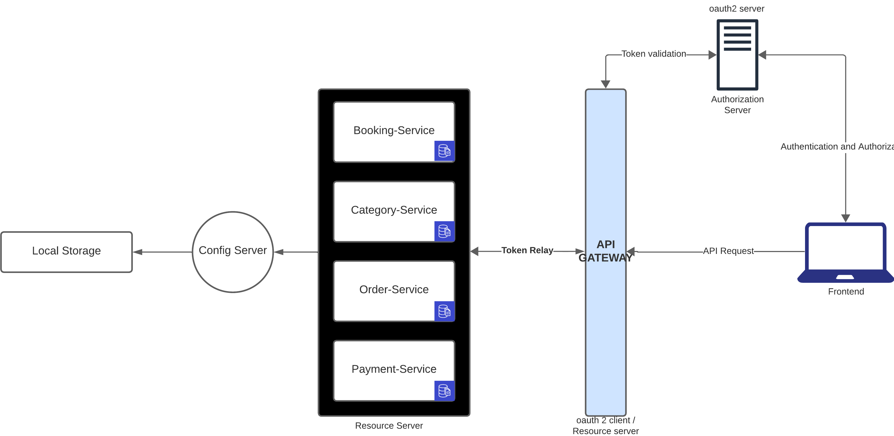

# TRAVEL BOOKING SYSTEM MICROSERVICE
This project is a travel booking system aimed at providing a reliable and user-friendly platform for booking travel accommodations such as flights, hotels, and rental cars.

## FEATURES
- Flight Booking: Users can search and book flights based on their preferences such as date, time, and destination.
- Hotel Booking: Users can search and book hotel accommodations based on location, date, and amenities.
- Rental Car Booking: Users can search and book rental cars based on pickup location, date, and car type.
- Accommodation Booking: Users can search and book accommodations based on location, type( house, appartment), and capacity
- User Authentication: Secure user authentication system to manage user accounts and bookings.
- Admin Panel: Admin panel for managing flights, hotels, rental cars, and user bookings.

## TECHNOLOGIES USED
- Angular: Frontend framework for building the user interface.
- Spring Boot: Backend server for handling requests, user authentication, user authorization and database operations.
- MongoDB: NoSQL database for backend data.
- Bootstrap: Frontend framework for responsive design and styling.

## BACKEND TECHNOLOGIES (MICROSERVICES OVERVIEW)

### Eureka Discovery
Service discovery server responsible for registering and locating microservices within the system.

### Config Server
Centralized configuration server responsible for storing and serving configuration properties for microservices.

### API Gateway
Acts as a single entry point for client applications to communicate with the backend microservices. It provides routing, and load balancing.

### Authorization Server
Microservice responsible for user authentication and authorization using OAuth2. (auth-server)

### Resource Server
Protect resources using Bearer Token authentication using JWT. (booking-service, category-service, order-service, payment-service, gateway)

### Booking Service
Microservice responsible for managing bookings, including flight, hotel, and rental car and accommodations.

### Category Service
Microservice responsible for managing categories of accommodations, flights, rental cars, and hotel.

### Payment Service
Microservice responsible for handling payment transactions for bookings.

### Order Service
Microservice responsible for managing orders and cart items

## DISCOVERY SERVER CONFIGURATION

## API GATEWAY

## CLIENT RESOURCE REQUEST

## DATABASE MODEL

### USER

### CATEGORY

### BOOKING

### ORDER

### PAYMENT
